# OKPH

[](https://github.com/Fcmam5/okph/actions/workflows/main.yml)
[](https://www.npmjs.com/package/@fcmam5/okph)
[](LICENSE)

Git-native graph and impact-analysis tool for OKF knowledge bases. Generates a clickable Mermaid graph from a folder of Markdown files (default output; other formats may follow).

## Install

```bash
npm i -g @fcmam5/okph
# or
pnpm i -g @fcmam5/okph
```

## CLI

```bash
okph graph ./docs
okph graph ./docs --base-url https://example.com/docs
okph graph ./docs --allow-large
okph deps docs/ledger.md        # files ledger.md links to
okph dependents docs/ledger.md  # files linking to ledger.md
okph deps docs/ledger.md --graph  # same, as a Mermaid subgraph
okph affected docs/ledger.md      # ledger.md + everything transitively linking to it
okph affected docs/ledger.md --graph
okph affected --git HEAD~1         # changed markdown since HEAD~1 + their dependents
okph affected --git main --graph
okph affected --git main --root docs  # only look at docs/, ignore the rest of the repo
okph affected --git main --root docs --md  # same, as a markdown link list
okph affected --git main --root docs --exclude '**/{index,log}.md'  # skip files entirely
okph validate ./docs                  # check the bundle against the OKF spec
okph validate ./docs --strict         # also fail on warnings (CI gate)
```

`validate` checks a bundle against the OKF spec and prints findings as `path -> target [level] kind: message`, sorted by path. Errors are spec MUSTs (missing or unparseable frontmatter, missing `type`, `index.md`/`log.md` misuse); warnings are spec SHOULDs and tolerated problems (broken links, missing files named by `resource`/`computation`/`executor`/`attester`, relative links, orphans, malformed `status`/`tags`/`generated`/`verified`, missing `description`). Exits `1` on any error — warnings pass unless `--strict` is set.

`deps`/`dependents`/`affected` scan the knowledge base from the current working directory and print sorted paths, one per line — no Mermaid. Paths are relative to your cwd, so run from the repo root for repo-relative output. `affected` means *potentially* affected: reachable through links, not necessarily impacted. Links are read as citations — `a → b` means "a relies on b's content", so `affected b.md` reports `b.md` plus everything that cites it, transitively. `affected --git <base>` seeds from markdown files changed or deleted since `<base>` (commits, working tree, and untracked files), then reports those files plus their transitive dependents — useful for "what might need review after this branch" checks.

### Keeping repo files out of the graph

Run from a repo root and the scan picks up `README.md`, `CONTRIBUTING.md` and friends. If your README links into the knowledge base, it cites those documents and shows up in every `affected` result.

Use `--root <dir>` to scan only the knowledge base:

```bash
okph affected --git main --root docs
```

Files outside `<dir>` are not scanned and never appear in the output. You still write `<file>` and read results relative to where you are, so `--root docs` still prints `docs/ledger.md`.

### Index files

`index.md` and `log.md` are reserved files (spec §3.1): a listing enumerates documents and a log chronicles them — neither relies on them. So links *out of* them don't count as dependencies: they never get added as dependents, and `affected` doesn't propagate through them. Links *to* them still count, and naming one directly works — `deps index.md` lists its links, `dependents index.md` reports what links to it, `affected index.md` includes it as a seed. They're drawn dotted in `graph` output.

`--include-nav` turns that off. You shouldn't need it: spec §3.1 says reserved files can't be concept documents, so real content in one means the bundle is wrong.

In `--graph` output the queried document is drawn with a filled highlight so it stands out among the other nodes. For `affected --git`, every changed file included in the rendered graph is highlighted by status: green = added, amber = modified, red = deleted.

`graph` output is Mermaid graph syntax printed to stdout. Pipe it to a file or Mermaid renderer.

Note on scan scope: `graph <path>` recursively reads every `.md` file under `<path>` — including paths outside your cwd (e.g. `okph graph /some/dir`). `deps`/`dependents`/`affected` scan from the current working directory, or from `--root <dir>` when given.

Graphs over 500 nodes or edges fail by default, since many renderers (e.g. GitHub) truncate them. Pass `--allow-large` to render anyway.

## API

```ts
import { generateMermaid } from "@fcmam5/okph";

const graph = await generateMermaid("./docs", {
  baseUrl: "https://example.com/docs",
});
```

## Example

The example below was generated from the [`supachai-j/open-knowledge-format-starter`](https://github.com/supachai-j/open-knowledge-format-starter) OKF bundle using `--base-url`.

```mermaid
graph TD
  n_a48746ca["Subdirectories"]
  n_7204c0a4["Directory Update Log"]
  n_e5402305["Metrics"]
  n_c332fa58["Weekly Active Users (WAU)"]
  n_84209736["Incident Response (Sev1/Sev2)"]
  n_2ee90f39["Playbooks"]
  n_620ec17c["Subdirectories"]
  n_84ac5870["Joins"]
  n_c61967be["Orders → Customers join"]
  n_ea678391["Customers"]
  n_50516fd3["Tables"]
  n_17ec6115["Orders"]
  n_c61967be --> n_ea678391
  n_c61967be --> n_17ec6115
  click n_a48746ca "https://github.com/supachai-j/open-knowledge-format-starter/blob/main/wiki/index.md"
  click n_7204c0a4 "https://github.com/supachai-j/open-knowledge-format-starter/blob/main/wiki/log.md"
  click n_e5402305 "https://github.com/supachai-j/open-knowledge-format-starter/blob/main/wiki/metrics/index.md"
  click n_c332fa58 "https://github.com/supachai-j/open-knowledge-format-starter/blob/main/wiki/metrics/weekly-active-users.md"
  click n_84209736 "https://github.com/supachai-j/open-knowledge-format-starter/blob/main/wiki/playbooks/incident-response.md"
  click n_2ee90f39 "https://github.com/supachai-j/open-knowledge-format-starter/blob/main/wiki/playbooks/index.md"
  click n_620ec17c "https://github.com/supachai-j/open-knowledge-format-starter/blob/main/wiki/references/index.md"
  click n_84ac5870 "https://github.com/supachai-j/open-knowledge-format-starter/blob/main/wiki/references/joins/index.md"
  click n_c61967be "https://github.com/supachai-j/open-knowledge-format-starter/blob/main/wiki/references/joins/orders__customers.md"
  click n_ea678391 "https://github.com/supachai-j/open-knowledge-format-starter/blob/main/wiki/tables/customers.md"
  click n_50516fd3 "https://github.com/supachai-j/open-knowledge-format-starter/blob/main/wiki/tables/index.md"
  click n_17ec6115 "https://github.com/supachai-j/open-knowledge-format-starter/blob/main/wiki/tables/orders.md"
```



<details>
<summary>How this example was generated</summary>

```bash
git clone --depth 1 https://github.com/supachai-j/open-knowledge-format-starter.git /tmp/okf-starter
okph graph /tmp/okf-starter/wiki \
  --base-url https://github.com/supachai-j/open-knowledge-format-starter/blob/main/wiki
```

</details>

## Security & Privacy

- No network calls, no telemetry.
- No file writes unless explicitly requested.
- Output is sanitized: labels are escaped and click hrefs only allow `http(s)://` and relative paths.
- See [PRIVACY.md](./PRIVACY.md) for details.

## License

MIT